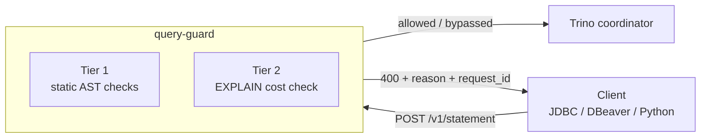

# query-guard

[](https://github.com/wpunit13/query-guard/actions/workflows/ci.yml)

A lightweight, stateless Layer 7 reverse proxy that sits in front of a database
cluster coordinator (initially **Trino**) and protects clusters from runaway
queries by inspecting incoming SQL before it reaches the coordinator.

**Fail-open by design:** if parsing, evaluation, or the pre-flight times out,
the query is forwarded unchanged — a safety tool must never cause platform
downtime.

## How it works

Every `POST /v1/statement` passes through two tiers:

1. **Tier 1 — Static AST filter** (sub-millisecond, in-memory): table
   blocklists, function/UDF blocklists, `SELECT *` restrictions, required
   partition filters (any-of/all-of), statement blocklists.
2. **Tier 2 — Pre-flight cost check**: shadow-executes
   `EXPLAIN (TYPE IO, FORMAT JSON)` to estimate scan bytes, rows, and CPU cost
   against configured limits.



Violations return a JSON `400` with a machine-readable `reason` and a
`request_id` for correlation. Everything else (auth headers, session
properties, `nextUri` polling) is mirrored 1:1 — clients work unchanged.

---

## Quick start (Docker, ~2 minutes)

Runs Trino + query-guard side by side, with a demo policy on the TPCH dataset:

```bash
scripts/docker-harness.sh start    # build image + start Trino & proxy
scripts/docker-harness.sh status   # health check
scripts/docker-harness.sh stop     # tear down
```

| Component | Address |
|-----------|---------|
| query-guard proxy (guarded) | `http://localhost:8091` |
| Trino (unguarded) | `http://localhost:8082` |

Try it:

```bash
# ✅ allowed
curl -s -X POST http://localhost:8091/v1/statement \
  -H 'X-Trino-User: demo' -d 'SELECT name FROM tpch.tiny.nation'

# ❌ blocked (table blocklist)
curl -s -X POST http://localhost:8091/v1/statement \
  -H 'X-Trino-User: demo' -d 'SELECT * FROM tpch.tiny.lineitem'
```

<details>
<summary><strong>What the demo policy blocks / allows</strong></summary>

| Query | Result |
|---|---|
| `SHOW TABLES FROM tpch.tiny` | ✅ bypassed |
| `SELECT name FROM tpch.tiny.nation` | ✅ allowed |
| `SELECT * FROM tpch.tiny.orders` | ❌ `REQUIRED_FILTER_MISSING` (needs `orderdate`) |
| `SELECT * FROM tpch.tiny.lineitem` | ❌ `TABLE_BLOCKLIST` |
| `SELECT regexp_count(name,'a') FROM tpch.tiny.nation` | ❌ `FUNCTION_BLOCKLIST` |
| `SELECT * FROM tpch.tiny.customer` | ❌ `SELECT_STAR_BLOCKED` |

Policy lives in `deploy/compose/policy.yaml` — edit it and the guard
hot-reloads (see the caveat about single-file bind mounts in `RUNBOOK.md`).

</details>

<details>
<summary><strong>Alternative: local processes (Java 25 + built binary)</strong></summary>

`scripts/test-drive.sh` brings up a local Trino coordinator (requires
**Java 25**, Temurin recommended) and the proxy against it:

```bash
scripts/test-drive.sh start    # build proxy, start Trino + proxy, wait until ready
scripts/test-drive.sh stop     # stop both
scripts/test-drive.sh status   # show what is running
scripts/test-drive.sh clean    # stop everything and delete ~/.query-guard-test
```

| Component | Address |
|-----------|---------|
| Trino coordinator | `http://localhost:8082` |
| query-guard proxy | `http://localhost:8090` |
| Health / metrics | `http://localhost:8090/healthz` · `/metrics` |

</details>

---

## Installation

Every release tag (`v*.*.*`) publishes three artifacts automatically:
a container image, a Helm chart, and release binaries.

<details open>
<summary><strong>Container image (GHCR)</strong></summary>

```bash
docker pull ghcr.io/wpunit13/query-guard:v1.0.1
```

Multi-arch (`linux/amd64` + `linux/arm64`), distroless nonroot runtime.
Tags: full semver (`v1.0.1`), minor (`1.0`), major (`1`), `latest`, `sha-<commit>`.

</details>

<details>
<summary><strong>Helm chart (GHCR OCI)</strong></summary>

```bash
helm install query-guard oci://ghcr.io/wpunit13/query-guard/chart \
  --version 1.0.1 \
  --set upstream.url=http://trino:8080
```

The chart ships Deployment (liveness `/healthz`, readiness `/readyz`),
Service, ConfigMap (policy), and an optional CPU-based HPA. Chart version and
`appVersion` are stamped from the git tag at package time.

Native TLS: enable with an existing `kubernetes.io/tls` Secret —
`--set tls.enabled=true --set tls.secretName=query-guard-tls`. The chart
mounts it at `/etc/query-guard/tls` and appends the `server.tls` block to the
policy automatically. Cert rotation is restart-based (`kubectl rollout restart`).

</details>

<details>
<summary><strong>Release binaries (no Docker / Go toolchain)</strong></summary>

Static binaries (linux + macOS, amd64 + arm64) are attached to each GitHub
Release, packaged with a default `policy.yaml` and `checksums.txt` — ideal for
building your own internal images from verified artifacts:

```bash
sha256sum -c checksums.txt
tar xzf query-guard_<version>_linux_amd64.tar.gz
./query-guard -config policy.yaml
```

</details>

---

## Configuration

All rules are **hot-reloadable** (edit `policy.yaml`, no restart),
**case-insensitive** for unquoted identifiers, and **off unless configured**
(empty/0/false = disabled).

```yaml
server:
  port: 8090

upstream:
  url: http://trino:8080

rules:
  # Tables that may never be queried. Bare names match any catalog/schema.
  table_blocklist:
    - lineitem

  # Functions/UDFs that may not appear anywhere in a statement
  # (projections, WHERE, CTEs, subqueries).
  function_blocklist:
    - regexp_count

  # Tables on which `SELECT *` is rejected; explicit column lists are fine.
  # COUNT(*) is not a projection star and is never flagged.
  select_star_blocked_tables:
    - wide_table

  # Required WHERE filters, scoped to exactly one schema.table
  # (catalog optional; no bare-name/suffix matching).
  required_filters:
    - catalog: finance          # optional; empty = any catalog
      schema: reporting
      table: daily_orders
      mode: any-of              # any-of | all-of (default all-of)
      columns: [ds, month, year]

  cost_limits:
    # Table-scoped: scan bytes / rows for matching tables.
    - catalog: tpch
      schema: tiny
      table: orders
      max_scan_bytes: 100000
      max_rows: 0               # 0 = disabled
    # Query-global limits.
    - max_scan_bytes_per_query: 8000000
      max_cpu_cost_per_query: 500.0   # plan-root CPU estimate; 0 = disabled

# Audit logging: one structured `audit_rejection` line per rejected query
# (rejections only — allowed/bypassed queries are never audited). Identity
# fields (user, client_tags) appear ONLY here, never in other logs;
# Authorization values are never logged anywhere.
audit:
  log_rejections: true
  snapshot_plan: true   # include Tier-2 cost estimates in the audit line
```

<details>
<summary><strong>Rejection reasons (JSON 400 body)</strong></summary>

| `reason` | Triggered by |
|---|---|
| `TABLE_BLOCKLIST` | Blocked table referenced |
| `REQUIRED_FILTER_MISSING` | Required WHERE column(s) absent (message lists them) |
| `STATEMENT_BLOCKLIST` | Blocked statement type |
| `COST_LIMIT_BREACH` | Scan-byte, row, or CPU-cost limit exceeded |
| `FUNCTION_BLOCKLIST` | Blocked function/UDF used |
| `SELECT_STAR_BLOCKED` | `SELECT *` on a restricted table |

</details>

<details>
<summary><strong>Behavior notes & edge cases</strong></summary>

- **Fail-open paths:** parser errors, pre-flight timeouts, concurrency-gate
  saturation, and bodies over the 8 MiB inspection cap are all forwarded
  unguarded (and counted in metrics).
- **Hot reload:** rules and upstream URL reload live via fsnotify. Caveat:
  single-file bind mounts (as in `deploy/compose`) can miss editor renames —
  see `RUNBOOK.md`.
- **`COUNT(*)` is never treated as `SELECT *`** — only projection-level stars
  are flagged.
- **Required filters are table-attributed:** a predicate on another table in
  a join cannot satisfy a guarded table's filter.
- **CPU cost cap is global-only** (CPU is not attributable per-table) and
  fails open when a plan carries no CPU estimate.

</details>

---

## Connecting clients

The proxy mirrors Trino's HTTP protocol 1:1 — any Trino client works
unchanged. Point it at the guard's port instead of the coordinator's.

<details open>
<summary><strong>DBeaver (guarded) — recommended</strong></summary>

1. **Driver:** install the `Trino` driver (Database ▸ Driver Manager ▸ New…,
   or search "Trino" in the connection wizard; click "Download/Update" if
   prompted).
2. **New connection → Trino:**

   | Field | Value |
   |-------|-------|
   | JDBC URL | `jdbc:trino://localhost:8091` |
   | Username | any non-empty value, e.g. `test-user` |
   | Catalog / Schema | `tpch` / `tiny` |

3. **Test / connect.** Guard violations surface as query errors containing
   `QUERY_GUARD_LIMIT_BREACH` and the `request_id`.

To connect **unguarded** (direct to Trino), use port `8082` instead.

</details>

<details>
<summary><strong>Authentication (Azure AD / GCP identity, LDAP, certificates, Kerberos)</strong></summary>

The proxy is a transparent passthrough: `Authorization` and all `X-Trino-*`
headers are mirrored 1:1 onto both the pre-flight request and the proxied
request — the guard never decodes or validates credentials.

| Trino auth type | Proxy support |
|---|---|
| `PASSWORD` (file, LDAP, Salesforce) | ✅ works today |
| `OAUTH2` (Azure AD, eIDP, cIDP, GCP) | ✅ works today |
| `JWT` | ✅ works today |
| `HEADER` (custom authenticators) | ✅ works today |
| `CERTIFICATE` (mTLS) | 🔜 planned (decoupled two-leg design) |
| `KERBEROS` (SPNEGO) | 🔜 planned (decoupled two-leg design) |

Notes for token-based auth: the IdP callback URL must be registered with the
**proxy-facing** hostname, and TLS on both legs is required (see Security
below). Certificate/Kerberos support is tracked in `NEXT_TASKS.md` (B8).

</details>

---

## Operations

<details open>
<summary><strong>Health, metrics & logging</strong></summary>

- `GET /healthz` — liveness. Always `200` while the process is up.
- `GET /readyz` — readiness. `200` when the upstream is reachable, `503`
  otherwise. Used by the Helm chart.
- `GET /metrics` — Prometheus metrics:
  `queryguard_queries_total{status,engine}`, `queryguard_blocked_bytes_total`,
  `queryguard_preflight_duration_seconds`, `queryguard_parser_errors_total`,
  `queryguard_preflight_rejected_total`,
  `queryguard_preflight_no_table_estimates_total`.

**Request correlation:** every statement request gets a **request ID** (from
an inbound `X-Request-ID` header, or minted) that appears in all guard log
lines for that request *and* in the JSON rejection body. Ask users for the
`request_id` from a rejected response to grep the guard's logs.

Logs are structured (`log/slog` key-value text). With `audit.log_rejections:
true`, every rejected query additionally emits an `audit_rejection` line with
the verbatim query, reason, tables, WHERE columns, user, client tags, and
(optional) cost snapshot.

</details>

<details>
<summary><strong>TLS & security posture</strong></summary>

**Token handling.** `Authorization` and `X-Trino-*` headers are mirrored 1:1
onto both the pre-flight request and the proxied client request. They are
never decoded, validated, logged, or persisted. `Authorization` values never
appear in any log output — including opt-in audit lines
(`TestNoCredentialLogging` enforces this).

**TLS topologies** (in order of preference):

1. **TLS on both legs (recommended).** Native TLS on the client→proxy leg
   (`server.tls.cert_file`/`key_file` → HTTPS-only listener + HSTS) *and* an
   `https://` Trino upstream URL. No plaintext anywhere.
2. **Service mesh mTLS (Istio/Linkerd).** Fully supported; no guard config
   needed.
3. **Ingress/LB TLS termination.** Acceptable only on a trusted pod network —
   pod-to-pod traffic (including Bearer tokens) is capturable there.

In the Helm chart: `--set tls.enabled=true --set tls.secretName=query-guard-tls`
(mounts an existing `kubernetes.io/tls` Secret; rotation is restart-based).

**Fail-open semantics.** Parser failures, pre-flight timeouts, and internal
errors forward the original query rather than dropping it. The tradeoff — a
crafted query that breaks the parser bypasses the guard — is a recorded scope
decision (`NEXT_TASKS.md` B6).

</details>

<details>
<summary><strong>Performance</strong></summary>

Measured with the in-repo load harness
(`go test ./internal/integration/ -run TestLoad -v`). The coordinator is a
fake with a 10ms-per-hop pre-flight delay — these numbers measure **proxy
overhead**, not real Trino EXPLAIN cost (which dominates in production).

- **Pre-flight (Tier 2) latency** — 200 submissions, 16 concurrent clients,
  `preflight.max_concurrent: 5`:
  - Tier 2 OFF: P50 ≈ 2.4ms, P95 ≈ 12ms
  - Tier 2 ON: P50 ≈ 38ms, P95 ≈ 50ms (3 protocol hops × 10ms + gate queueing)
- **Streaming memory (flat)** — 4 × 32 MiB JSON pages through the URL-rewrite
  path allocated ≈ **1 MiB** of proxy memory total. Pages are never fully
  buffered.

</details>

---

## Project layout

```
cmd/queryguard/            entrypoint, TLS listener, graceful shutdown
internal/
  config/                  policy schema, validation, fsnotify hot-reload
  parser/                  statement classifier + vitess AST/token analysis
  engine/                  CostEvaluator interface + Trino EXPLAIN implementation
  proxy/                   HTTP handler, reverse proxy, rejection responses
  telemetry/               Prometheus metrics
  ctxlog/                  request-ID correlation
  integration/             end-to-end tests + load harness
deploy/
  Dockerfile               multi-stage distroless build
  helm/                    chart (Deployment, Service, ConfigMap, HPA)
  compose/                 Docker test harness (Trino + guard)
scripts/                   harness + test-drive scripts
RUNBOOK.md                 operational guide: metrics, alerts, incidents
```

## Status & roadmap

- `progress.md` — implementation phase tracker
- `NEXT_TASKS.md` — packaging/production-readiness backlog (CI, GHCR
  publishing, upstream TLS, certificate/Kerberos auth) and deferred scope
- `RUNBOOK.md` — operational guidance
- `CODE_REVIEW.md` — review findings and their resolution status

## Contributing

```bash
go build ./...
go vet ./...
go test ./...          # includes integration + load tests
gofmt -l .             # must be empty
helm lint deploy/helm/
```

CI runs the same checks on every PR. Keep every guard rule **fail-open**,
**hot-reloadable**, and covered by tests.
